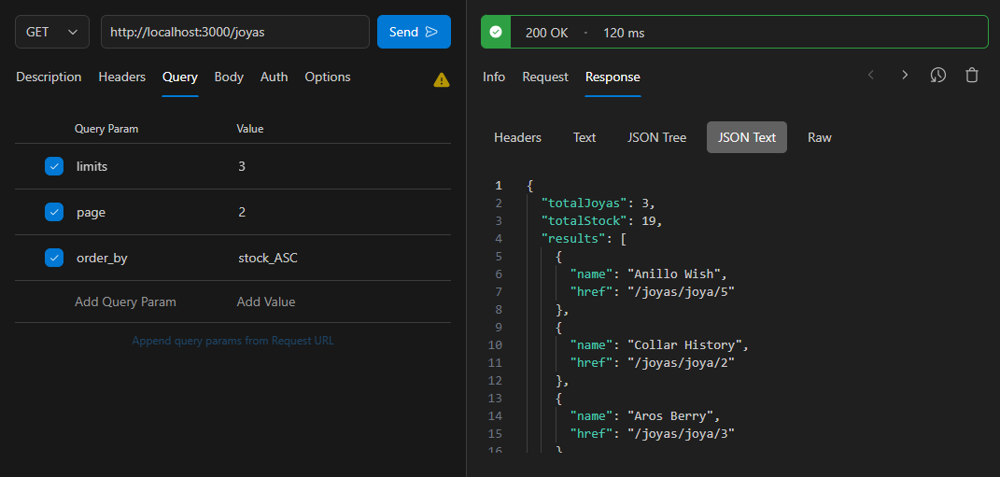
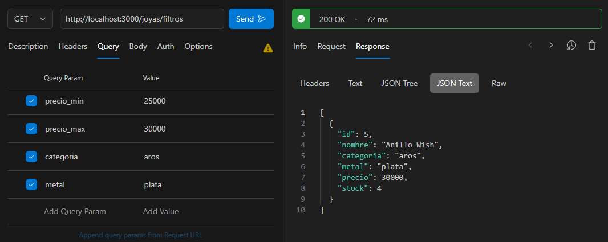

# Desafío - Tienda de Joyas 💍

En este desafío, he desarrollado una API REST para la tienda de joyas My Precious Spa, utilizando Node.js, Express y PostgreSQL, cumpliendo con los requerimientos de límite, filtrado, paginación, ordenamiento y estructura de datos HATEOAS.

## Descripción 📋

La tienda de joyas My Precious Spa necesita una aplicación moderna y dinámica. Este desafío consiste en crear una API REST que permita:
1. Límite de recursos.
2. Filtro de recursos por campos.
3. Paginación.
4. Ordenamiento.
5. Estructura de datos HATEOAS.

### Capturas de pantalla 📸

Consulta de joyas con cláusulas en estructura de datos HATEOAS:



Filtrando las joyas por precio máximo, mínimo, categoría y metal:



### Archivos del Proyecto 📂

- **app.js**: Archivo principal del servidor que gestiona las rutas y las operaciones CRUD.
- **joyas.models.js**: Módulo que contiene las funciones para interactuar con la base de datos PostgreSQL.
- **db_connect.js**: Archivo que configura y maneja la conexión a la base de datos.
- **logServer.js**: Middleware para generar informes o reportes de actividades.
- **hateoas.js**: Archivo que contiene la lógica para estructurar los datos según HATEOAS.
- **ddl.sql**: Script SQL para crear la base de datos y la tabla de inventario.
- **dml.sql**: Script SQL para insertar datos de ejemplo en la tabla de inventario.
- **package.json**: Archivo que define las dependencias del proyecto.

### Funcionalidades 🔧

- **Límite de recursos**: Permite limitar la cantidad de joyas devueltas por página.
- **Filtro de recursos por campos**: Filtra las joyas según precio, categoría y metal.
- **Paginación**: Define la página de resultados.
- **Ordenamiento**: Ordena las joyas según un campo especificado.
- **Estructura de datos HATEOAS**: Devuelve las joyas en una estructura HATEOAS.

## Requerimientos del Desafío 🎯

1. Crear una ruta GET /joyas que:
   - Devuelva la estructura HATEOAS de todas las joyas almacenadas en la base de datos (1.5 puntos).
   - Reciba en la query string los parámetros `limits`, `page` y `order_by` (2 puntos).

2. Crear una ruta GET /joyas/filtros que reciba los parámetros `precio_max`, `precio_min`, `categoria` y `metal` en la query string (3.5 puntos).

3. Implementar middlewares para generar informes o reportes de alguna actividad o evento específico que ocurra en cada una de las rutas (1 punto).

4. Usar try catch para capturar los posibles errores durante una consulta y la lógica de cada ruta creada (1 punto).

5. Usar las consultas parametrizadas para evitar el SQL Injection en la consulta a la base de datos relacionada con la ruta GET /joyas/filtros (1 punto).

## Uso de la Aplicación 🚀

### Instalación

Para instalar las dependencias y ejecutar la aplicación, utiliza los siguientes comandos:

```bash
npm install
npm run dev
```

### Instalación

- GET /joyas: Devuelve una estructura HATEOAS de las joyas registradas.
- GET /joyas/filtros: Filtra las joyas según precio, categoría y metal.

## Código 🧩

### app.js

```javascript
import express from 'express'
import cors from 'cors'

import { logServer } from './middlewares/logServer.js'
import { findAll, findFiltered } from './models/joyas.models.js'
import { hateoasstructure } from '../utils/hateoas.js'

const app = express()
const PORT = process.env.PORT ?? 3000

app.use(cors())
app.use(express.json())

app.use(logServer)

app.get('/joyas', async (req, res) => {
  try {
    const result = await findAll(req.query)
    const HATEOAS = hateoasstructure(result)
    res.status(200).json(HATEOAS)
  } catch (error) {
    res.status(500).json({ status: false, message: `Ha ocurrido un error, código: ${error.message.code}` })
  }
})

app.get('/joyas/filtros', async (req, res) => {
  try {
    const result = await findFiltered(req.query)
    res.status(200).json(result)
  } catch (error) {
    res.status(500).json({ status: false, message: `Ha ocurrido un error, código: ${error.message.code}` })
  }
})

app.listen(PORT, () => console.log(`Servidor funcionando en puerto: ${PORT}`))

export default app
```

### joyas.models.js

```javascript
import db from '../database/db_connect.js'
import format from 'pg-format'

export const findAll = async ({ limits = 10, page = 1, order_by = 'precio_DESC' }) => {
  const query = 'SELECT * FROM inventario'
  const [column, sort] = order_by.split('_')
  const offset = Math.abs(page > 0 ? page - 1 : 0) * limits
  const formatedQuery = format(`${query} ORDER BY %s %s LIMIT %s OFFSET %s;`, column, sort, limits, offset)
  return await db(formatedQuery)
}

export const findFiltered = async ({ precioMin, precioMax, categoria, metal }) => {
  let query = 'SELECT * FROM inventario'
  const filters = []
  const values = []

  if (precioMin) {
    values.push(precioMin)
    filters.push(`precio > $${values.length}`)
  }

  if (precioMax) {
    values.push(precioMax)
    filters.push(`precio < $${values.length}`)
  }

  if (categoria) {
    values.push(categoria)
    filters.push(`categoria = $${values.length}`)
  }

  if (metal) {
    values.push(metal)
    filters.push(`metal = $${values.length}`)
  }

  if (filters.length > 0) {
    query += ` WHERE ${filters.join(' AND ')}`
  }

  return await db(query, values)
}
```

### db_connect.js

```javascript
import pg from 'pg'

const { Pool } = pg

const config = {
  user: process.env.DB_USER,
  password: process.env.DB_PASSWORD,
  host: process.env.DB_HOST,
  port: process.env.DB_PORT,
  database: process.env.DB_DATABASE,
  allowExitOnIdle: true
}

const pool = new Pool(config)

const db = async (query, values) => {
  try {
    const result = await pool.query(query, values)
    return result.rows
  } catch (error) {
    console.error('[db_connect] => db:', error)
    const newError = { status: false, message: error }
    throw newError
  }
}

export default db
```

### logServer.js

```javascript
export const logServer = (req, res, next) => {
  console.info({
    url: req.path,
    method: req.method,
    body: req.body,
    params: req.params,
    query: req.query
  })
  next()
}
```

### hateoas.js

```javascript
export const hateoasstructure = (joyas) => {
  let totalJoyas = 0
  let totalStock = 0

  const results = joyas.map((element) => {
    totalJoyas += 1
    totalStock += element.stock
    return {
      name: element.nombre,
      href: `/joyas/joya/${element.id}`
    }
  })

  return {
    totalJoyas,
    totalStock,
    results
  }
}
```

## Tecnologías Utilizadas 💻

- Node.js
- Express.js
- PostgreSQL
- CORS

## Mejoras Futuras 🚀

- Implementar autenticación y autorización.
- Añadir validaciones más robustas para los datos de entrada.
- Ampliar la funcionalidad de filtrado y búsqueda.